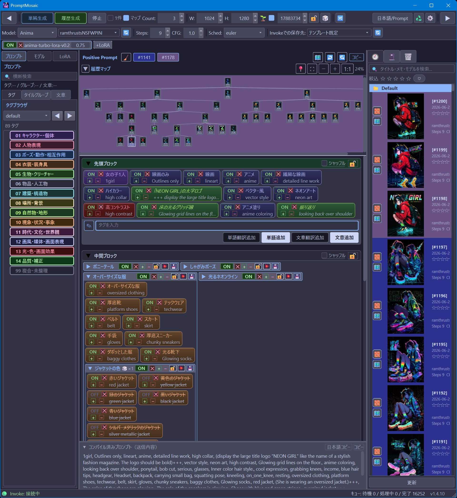
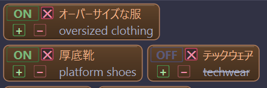
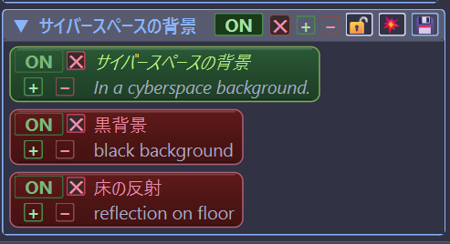
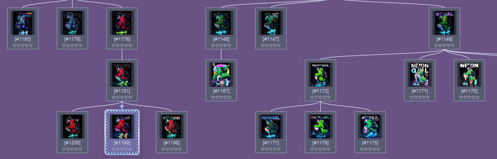

# PromptMosaic

[日本語](README.md) | [English](README_EN.md)

## 最新更新: v1.6.1

- Invokeの生成テンプレート取得を厳密化し、モデル・LoRA・ポジティブ／ネガティブ条件付け・CFG・シード・画像出力など、PromptMosaicが必要とする経路が揃っている場合だけ登録するようにしました。
- 取得できない場合は、Invoke側で何を有効／無効にして再生成すればよいかを取得画面に表示し、技術的な判定内容も同じ欄の「詳細」に表示します。
- AnimaやZ-Imageで、LoRAなし／CFG 1／ネガティブ条件付けなしの不完全なテンプレートを再利用して生成結果が変わる問題を防止しました。旧テンプレートは更新後に再取得が必要です。
- FLUXではPromptMosaicのCFG操作をガイダンスへ適用し、true CFGは1.0のまま維持するようにしました。
- 未検証のベースモデルも一覧から隠さず「未検証」と表示し、今後の対応に必要な手掛かりを残します。

- 単語・文章・通常グループを左から右へ半角スペースで結合する「接続グループ」を追加しました。`red` と `sneakers` のような要素を再利用しながら `red sneakers` を組み立てられます。
- 各要素の `🔗` をドラッグすると一時的な曲線と挿入位置を表示し、接続列への前後挿入、並べ替え、取り外し、前後での分割ができます。
- 接続グループは中央ペインで縦に並び、内部だけを横スクロールします。内部グループを折り畳むと、モードアイコンと名前の先頭を残した等幅表示になります。
- グループのコピーボタンを押すと中央ペインへ即座に複製します。接続グループの複製はプロンプトの二重出力を防ぐため、全体出力OFFで作成されます。
- 接続グループの `✓✓` から、配下すべてのランダム／シーケンシャルグループの候補タイルを再帰的にONへ戻せるようにしました。
- PromptMosaic形式をv2へ更新し、接続順、出力ON/OFF、横幅、折り畳み状態を保持します。v1形式も引き続き読み込めます。
- グループ内の一括ONボタンを押すと、グループの縦幅が極端に縮む問題を修正しました。
- 右ペインの各履歴画像から、グループ構造・ON/OFF状態・グループ幅・生成設定を含む1画像単位のPromptMosaic形式データをエクスポートできるようにしました。インポートはポジティブプロンプトのコピーボタンの右側から行えます。
- グループ直下の要素だけを一括ONにするボタンを追加しました。入れ子グループのON/OFF状態は変更しません。
- グループの横幅をドラッグで広げられるようにし、幅を保存するとともに、折り返し行数に合わせて縦幅も自動調整するようにしました。
- Animaなどネガティブプロンプトを利用できるテンプレートで、ネガティブプロンプ欄が表示されない場合がある問題を修正しました。
- 重要：InvokeAI 6.13.7以降を使用する場合は、シングルユーザーモードで起動してください。PromptMosaicはマルチユーザーモードには対応していません。
- モデル指定生成で未定義変数により失敗する場合がある問題を修正しました。
- 複製した生成テンプレートの初回利用時にベース判定が誤り、テンプレートキャッシュが無効化される場合がある問題を修正しました。
- LoRA 配線名が異なるテンプレートで注入検証が誤判定する問題と、接続確認・履歴同期・ボード一覧ワーカーの終了済みオブジェクトが長時間セッションで蓄積する問題を修正しました。

- Invoke 6.13.5.rc1 では Anima のワークフロー構造が変わったため、Anima を使う場合は Invoke 側で Anima 生成を一度行い、PromptMosaic の「Invoke データ取得」から Anima の生成テンプレートを再取得してください。
- Invoke 6.13.5.rc1 で Anima などの生成テンプレートを再取得した後、メイン画面が削除済みの古いテンプレート ID を保持して生成できなくなる場合がある問題を修正しました。
- アップデートバッチの Git 判定ミスにより、古い `update_windows.bat` では更新に失敗する場合がある問題を修正しました。失敗する場合は、GitHub の **Raw** から `update_windows.bat` だけを保存し直すか、v1.5.0 ZIP 内の `update_windows.bat` だけを今まで使っていた PromptMosaic フォルダへ上書きしてから再実行してください。
- 履歴マップに「ドラフトノード」を追加し、画像生成前の編集状態を画像のない履歴ノードとして保存できるようにしました。
- ドラフトノードから生成した画像は、履歴マップ上で子ノードとして接続されます。
- 右ペイン履歴にドラフト行を表示し、ドラフト行の履歴タイル表示とプロンプトタイルのドラッグ＆ドロップに対応しました。
- 子ノードのないドラフトノードは削除可能にし、子ノードのあるドラフトノードは系譜保護のため削除不可にしました。
- 画像履歴を削除しても、履歴マップ上では削除済みノードとして系譜を保持します。
- 履歴マップ上のドラッグ＆ドロップで系譜の接続変更に対応しました。拡大履歴マップと中央ペイン履歴マップの両方で利用できます。
- 親ノードを移動した場合、子孫ノードも系譜を保ったまままとめて移動します。
- Invokeのインストールパスを設定できる項目を追加しました。
- Invoke画像の保存先パスが未設定の場合、履歴マップ画像ビューアで設定が必要であることを表示し、Invokeパス設定へ移動できるようにしました。
- Invokeの多層画像保存フォルダ構成に対応しました。
- 履歴マップの画像ビューアに画像パス表示と画像フォルダを開く機能を追加しました。
- Invoke保存先ボードの既定表示、履歴マップ、中央ペイン履歴マップ、画像ビューアの表示文言を多言語対応しました。
- 全言語リソースを更新しました。
- 履歴タイルモードから通常表示へ戻る際の応答性と、前回履歴タイルモードを開いた状態で起動した場合の起動時応答性を改善しました。

---

**PromptMosaic** は、画像生成ツール [Invoke](https://invoke.ai/) のための、ローカルで動くプロンプト管理・生成 GUI です。
Invoke を横に開き、生成結果を見ながら PromptMosaic 側で生成指示、プロンプト編集、履歴管理を行う使い方を想定しています。英語プロンプトと日本語などの表示名を同時に扱いながら、プロンプトを「タイル」として組み立てられることを重視しています。LM Studio を翻訳用に設定すると、日本語の単語や文章を英語プロンプトへ変換してタイル化できます。画像生成そのものは Invoke が行います。

- **Invoke の横に表示して運用** — Invoke を横で開き、PromptMosaic で生成指示、プロンプト編集・履歴管理

  

- **二言語表示のタイル編集** — 英語プロンプトと訳文の日本語などの表示名を並べて見ながら、単語・文章をタイルとして D&D で並べ替え・強調・ON/OFF

  

- **タイルグループ** — タイルを Shift+D&D で重ねてグループ化が可能。見出しをダブルクリックしモード変更して「全て・順番・ランダム選択」で差分生成に利用できます。グループとして保存もできます。

  

- **翻訳支援** — LM Studio を使い、日本語の単語や文章を英語プロンプト用タイルに変換
- **生成系譜（パラレルワールド履歴マップ）** — どの生成からどの生成が派生したかをツリーで可視化し、過去の任意の時点へジャンプ

  

- **マルチモデルプラン** — 複数のモデル／LoRA／パラメータを一度の生成で巡回
- **11 言語対応** — 日本語・英語・中国語（簡体／繁体）・韓国語・ドイツ語・フランス語・スペイン語・イタリア語・ポルトガル語（ブラジル）・ロシア語
- **シンプルなデータ保全** — `data` フォルダを丸ごとコピーしてバックアップ

> **バージョン:** 1.6.1
> **対象 Invoke:** 6.13 以降
> **対応 OS:** Windows 11（PySide6 / Python 3.11 推奨）

---

## 📖 ドキュメント

| ドキュメント | 内容 |
| --- | --- |
| **[チュートリアル（はじめての方へ）](docs/TUTORIAL.md)** | インストール → Invoke 連携 → 最初の 1 枚を生成するまで |
| **[操作説明書（全機能リファレンス）](docs/MANUAL.md)** | 画面構成・各機能の詳しい使い方 |

---

## ⚡ クイックスタート

### 1. ファイル一式をダウンロードする

このページの右上あたりにある緑色の **Code** ボタンを押し、**Download ZIP** を選びます。ダウンロードした ZIP ファイルを右クリックして **すべて展開** を選び、好きな場所に展開してください。

> ⚠️ `install_windows.bat` だけを単体で保存しても動きません。必ず ZIP を丸ごと展開して、PromptMosaic のフォルダごと使ってください。

### 2. インストールする

展開したフォルダを開き、`install_windows.bat` をダブルクリックします。黒い画面が開いて、必要なものを自動で入れます。

Windows が「発行元を確認できませんでした」と表示した場合は、ファイル名が PromptMosaic フォルダ内の `install_windows.bat` であることを確認して **実行** を押します。インストーラは起動用の `PromptMosaic.bat` から同じ警告をできるだけ解除します。詳しくは [チュートリアル](docs/TUTORIAL.md) を見てください。

### 3. 起動する

インストールが終わったら、同じフォルダにある `PromptMosaic.bat` をダブルクリックします。

```bat
:: 初回だけ
install_windows.bat

:: 2回目以降はこちら
PromptMosaic.bat
```

初回起動時に **Invoke データ取得** ウィザードが開きます。Invoke（6.13 以降）を起動した状態で、画面の案内に従ってモデル・LoRA・生成テンプレートを取得してください。詳しくは [チュートリアル](docs/TUTORIAL.md) を参照してください。

失敗した場合は黒い画面に理由が表示されます。内容を確認してから、キーボードの何かのキーを押して閉じてください。

---

## 🔄 アップデート

PromptMosaic のプロンプト、履歴、取得済みモデル情報、生成テンプレートなどは `data` フォルダに保存されます。アップデートでは **古い PromptMosaic フォルダを削除しないでください**。

1. PromptMosaic を終了します。
2. 今まで使っていた PromptMosaic フォルダを開きます。
3. `update_windows.bat` をダブルクリックします。
4. 黒い画面で `Update complete.` と表示されたら完了です。

`update_windows.bat` は、GitHub から最新版 ZIP を自動取得し、`data` / `.venv` / `.git` / `_update_backups` を残して本体ファイルを丸ごと置き換えます。`data` フォルダのバックアップは実行時に確認されます。

> `update_windows.bat` だけをGitHub画面から保存する場合は、必ず **Raw** を開いてから保存してください。GitHubの表示ページをそのまま保存すると、中身がHTMLになって動きません。通常はZIPを丸ごとダウンロードするのが安全です。
> リポジトリが Private の場合、ZIPの自動取得は404になることがあります。その場合はGit for Windowsを入れ、GitHubへログイン済みの状態で実行してください。バッチはZIP取得に失敗すると `git clone` での取得を試します。

---

## 📜 ライセンス

PromptMosaic は **[MIT License](LICENSE)** で公開されています。

- フォーク・改変・再配布・商用利用は自由です（クローズドソース製品への組み込みも可）。
- 再配布の際は、著作権表示とライセンス全文を含めてください。
- 本ソフトウェアは無保証で提供されます。

```
Copyright (c) 2026 i1623
```

> ⚠️ 同梱・依存する各サードパーティ（Invoke / Qt / その他ライブラリ）は、それぞれ独自のライセンスに従います。再配布の際は、`requirements.txt` に含まれる依存パッケージと各プロジェクトのライセンス条項を確認してください。PySide6 / shiboken6 の wheel は `LGPL-3.0-only OR GPL-2.0-only OR GPL-3.0-only` として配布されています。

---

## 🛠️ 開発方針とサポート範囲

PromptMosaic は個人開発のツールです。作者自身の Invoke 制作環境で継続して使える状態を保つこと、特に Invoke の変更へ追従することを主な目的にしています。

不具合報告や改善提案は歓迎しますが、すべての要望への対応や継続的な個別サポートは保証できません。機能追加は、作者自身の制作フローに必要なもの、または Invoke 連携の維持に必要なものを優先します。

PromptMosaic は、Claude Code と OpenAI Codex を使った AI 支援の「バイブコーディング」によって開発されています。仕様決定、確認、テスト、公開判断は i1623 が行っています。

ドキュメントやUI文言の多言語翻訳も AI 支援で作成しています。確認はしていますが、誤訳や不自然な表現が残る場合があります。見つけた場合は、やさしく報告してもらえると助かります。

---

## 🙏 謝辞（Acknowledgments）

PromptMosaic は、多くの素晴らしいオープンソースプロジェクトの上に成り立っています。各プロジェクトの作者・コミュニティに深く感謝します。

### Invoke

PromptMosaic は単体では画像を生成しません。実際の画像生成はすべて **[Invoke](https://invoke.ai/)** が行います。PromptMosaic は Invoke の txt2img ワークフローグラフを「生成テンプレート」として取得し、プロンプト・シード・パラメータだけを差し替えて Invoke のキューへ送信する補助ツールです。

Invoke の開発者・コントリビューターの皆さまの長年の取り組みなくして、本アプリは存在し得ません。心より御礼申し上げます。

### UI フレームワーク・配色

| プロジェクト | 用途 | 作者 / 提供 |
| --- | --- | --- |
| **[Qt for Python (PySide6 / shiboken6)](https://www.qt.io/qt-for-python)** | GUI フレームワーク全体 | The Qt Company（LGPL-3.0-only OR GPL-2.0-only OR GPL-3.0-only） |
| **[Catppuccin](https://github.com/catppuccin/catppuccin)** | テーマ配色（Mocha / Latte） | Catppuccin org |

### Python ライブラリ

| ライブラリ | 用途 | 作者 / 提供 | ライセンス |
| --- | --- | --- | --- |
| **[Pillow](https://github.com/python-pillow/Pillow)** | PNG メタデータ解析・画像処理 | Jeffrey A. Clark and contributors | MIT-CMU (HPND) |
| **[httpx](https://github.com/encode/httpx)** / **[httpcore](https://github.com/encode/httpcore)** | Invoke / LLM への HTTP 通信 | Encode (Tom Christie 他) | BSD-3-Clause |
| **[h11](https://github.com/python-hyper/h11)** | HTTP/1.1 プロトコル | Nathaniel J. Smith | MIT |
| **[anyio](https://github.com/agronholm/anyio)** | 非同期 I/O 抽象 | Alex Grönholm | MIT |
| **[certifi](https://github.com/certifi/python-certifi)** | ルート証明書 | Kenneth Reitz / PSF | MPL-2.0 |
| **[idna](https://github.com/kjd/idna)** | 国際化ドメイン名 | Kim Davies | BSD-3-Clause |
| **[exceptiongroup](https://github.com/agronholm/exceptiongroup)** | 例外グループの後方互換 | Alex Grönholm | MIT / PSF |
| **[typing_extensions](https://github.com/python/typing_extensions)** | 型ヒント拡張 | Python core team | PSF |

### 任意連携

- **[LM Studio](https://lmstudio.ai/)** — プロンプトの翻訳・自動分類に使えるローカル LLM サーバー（任意機能）。ローカルで扱いやすい LLM 実行・管理環境を提供してくださっている LM Studio 開発チームとコミュニティに感謝します。

> 再配布の際は各依存パッケージのライセンス条項に従ってください。特に PySide6 / shiboken6 は LGPL/GPL 系ライセンスの条件を確認してください。
