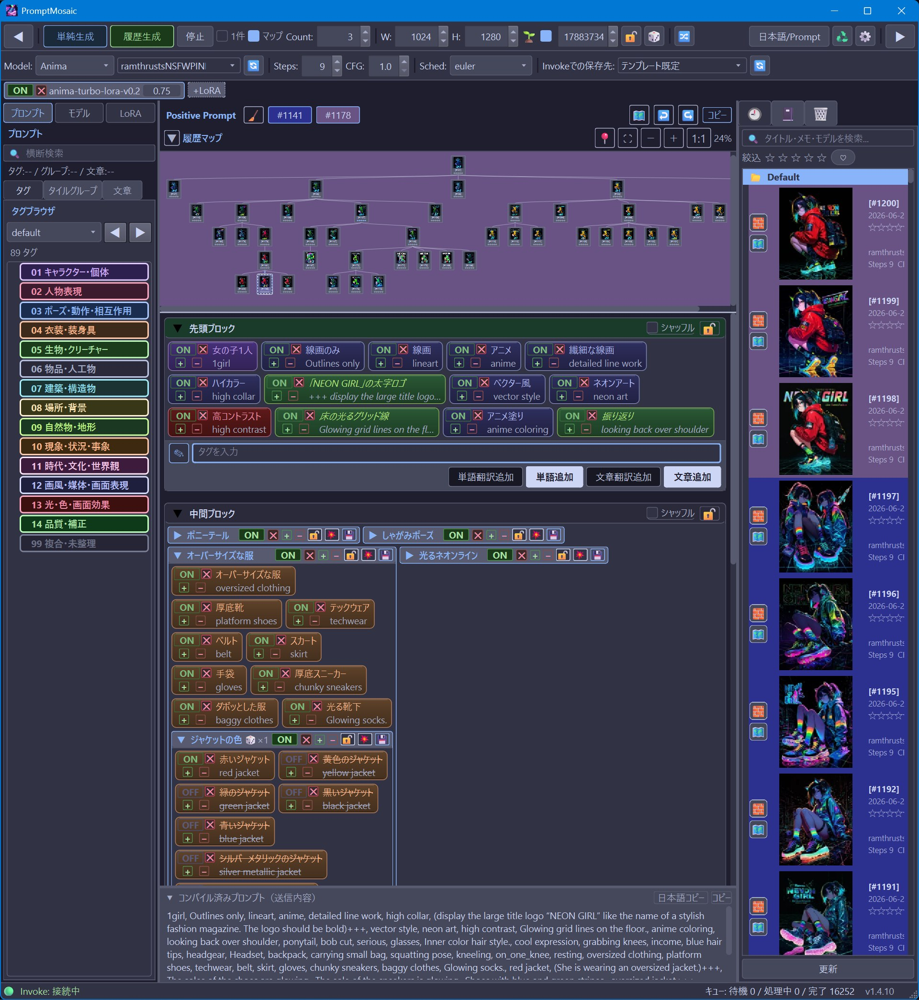

# PromptMosaic

[Japanese](README.md) | [English](README_EN.md)

**PromptMosaic** is a local prompt management and generation GUI for the image generation tool [Invoke](https://invoke.ai/).
It is intended to be used side by side with Invoke: keep the Invoke viewer open on one side, and edit prompts, history, and regeneration flow in PromptMosaic on the other. It is designed around editing English prompts while showing local-language labels, such as Japanese, side by side. If you configure a local LLM such as LM Studio for translation, PromptMosaic can turn words or sentences in your language into English prompt tiles. Image generation itself is performed by Invoke.

- **Side-by-side Invoke workflow** - keep Invoke's viewer visible while using PromptMosaic for prompt editing, history management, and regeneration.
- **Bilingual tile editing** - view English prompt text and translated local-language labels side by side while arranging words or sentences as tiles with drag-and-drop, emphasis, and ON/OFF toggles.
- **Tile groups** - group tiles together and use them for variation generation with all, sequential, or random selection modes. Tile groups support drag-and-drop and can be saved for reuse.
- **Translation assistance** - use a local LLM such as LM Studio to convert words or sentences into English prompt tiles.
- **Generation lineage / parallel-world history map** - visualize which generations branched from which results and jump back to any past point.
- **Multi-model plans** - cycle through multiple models, LoRAs, and generation parameters in one generation run.
- **11 languages** - Japanese, English, Chinese (Simplified / Traditional), Korean, German, French, Spanish, Italian, Portuguese (Brazil), and Russian.
- **Simple data backup** - back up PromptMosaic by copying the entire `data` folder.

> **Version:** 1.4.6
> **Target Invoke:** 6.13 or later
> **Supported OS:** Windows 11 (PySide6 / Python 3.11 recommended)

---

## Documentation

| Document | Contents |
| --- | --- |
| **[Tutorial](docs/TUTORIAL_EN.md)** | Install, connect to Invoke, and generate the first image |
| **[Manual](docs/MANUAL_EN.md)** | Full feature reference and screen-by-screen operation guide |

---

## Quick Start

### 1. Download all files

On this GitHub page, click the green **Code** button, then choose **Download ZIP**. After the ZIP file downloads, right-click it and choose **Extract All**. Open the extracted PromptMosaic folder.

> Downloading only `install_windows.bat` will not work. Use the whole extracted PromptMosaic folder.

### 2. Install

Double-click `install_windows.bat` inside the extracted folder. A black console window opens and installs the required files.

If Windows says it cannot verify the publisher, confirm that the file is `install_windows.bat` inside the PromptMosaic folder, then click **Run**. The installer tries to remove the same warning from the launcher `PromptMosaic.bat`. See the [Tutorial](docs/TUTORIAL_EN.md) for details.

### 3. Launch

After installation finishes, double-click `PromptMosaic.bat` in the same folder.

```bat
:: First run only
install_windows.bat

:: Later launches
PromptMosaic.bat
```

On first launch, the **Invoke Data Acquisition** wizard opens. Start Invoke 6.13 or later, then follow the wizard to fetch models, LoRAs, and generation templates from your current Invoke environment. See the [Tutorial](docs/TUTORIAL_EN.md) for details.

PromptMosaic is designed for a regular Python virtual environment. It does not require Conda or Anaconda, and the launcher avoids using Conda DLL paths when they are present on the machine.

If installation fails, the console stays open and shows the reason. Read the message, then press any key to close it.

---

## Update

Prompts, history, fetched model information, and generation templates are stored in the `data` folder. When updating, **do not delete your old PromptMosaic folder**.

1. Quit PromptMosaic.
2. Open your existing PromptMosaic folder.
3. Double-click `update_windows.bat`.
4. When the console shows `Update complete.`, the update is finished.

`update_windows.bat` downloads the latest ZIP from GitHub and replaces the application files while preserving `data`, `.venv`, `.git`, and `_update_backups`. It asks whether to back up the `data` folder before updating.

> If you save only `update_windows.bat` from GitHub, open **Raw** first and save that file. Saving the normal GitHub page creates an HTML file with a `.bat` name, and it will not run. Downloading the full ZIP is the safer option.
> If the repository is private, the automatic ZIP download may return 404. In that case, install Git for Windows and make sure you are signed in to GitHub. The updater falls back to `git clone` when ZIP download fails.

---

## License

PromptMosaic is released under the **[MIT License](LICENSE)**.

- Forking, modification, redistribution, and commercial use are allowed, including use inside closed-source products.
- When redistributing, include the copyright notice and full license text.
- This software is provided without warranty.

```text
Copyright (c) 2026 i1623
```

> Third-party projects and libraries used with PromptMosaic, including Invoke, Qt, and Python packages, are governed by their own licenses. When redistributing, review the license terms for the dependencies listed in `requirements.txt`. The PySide6 / shiboken6 wheels are distributed as `LGPL-3.0-only OR GPL-2.0-only OR GPL-3.0-only`.

---

## Development Policy and Support Scope

PromptMosaic is a personal project. Its main goal is to keep working in the author's own Invoke creative workflow, especially by tracking important Invoke changes.

Bug reports and suggestions are welcome, but continuous individual support and implementation of every request are not guaranteed. Feature work is prioritized when it is needed for the author's own workflow or for maintaining Invoke compatibility.

PromptMosaic was developed through AI-assisted "vibe coding" using Claude Code and OpenAI Codex. Direction, specification decisions, review, testing, and release decisions are handled by i1623.

Documentation and UI translations are also created with AI assistance. They are reviewed, but mistranslations or awkward wording may remain. Gentle correction reports are appreciated.

---

## Acknowledgments

PromptMosaic is built on many excellent open-source projects. Deep thanks to their authors and communities.

### Invoke

PromptMosaic does not generate images by itself. All actual image generation is handled by **[Invoke](https://invoke.ai/)** and the Invoke community. PromptMosaic fetches Invoke txt2img workflow graphs as **generation templates**, replaces only the prompt, seed, and known parameter fields, and submits the result to the Invoke queue.

This application would not exist without the long-running work of the Invoke developers and contributors. Tile emphasis supports a subset of Invoke / Compel-style `+` / `-` and numeric weights, but PromptMosaic does not implement or guarantee the full Compel syntax.

### UI Framework and Color Theme

| Project | Purpose | Author / Provider |
| --- | --- | --- |
| **[Qt for Python (PySide6 / shiboken6)](https://www.qt.io/qt-for-python)** | GUI framework | The Qt Company (LGPL-3.0-only OR GPL-2.0-only OR GPL-3.0-only) |
| **[Catppuccin](https://github.com/catppuccin/catppuccin)** | Theme colors (Mocha / Latte) | Catppuccin org |

### Python Libraries

| Library | Purpose | Author / Provider | License |
| --- | --- | --- | --- |
| **[Pillow](https://github.com/python-pillow/Pillow)** | PNG metadata parsing and image processing | Jeffrey A. Clark and contributors | MIT-CMU (HPND) |
| **[httpx](https://github.com/encode/httpx)** / **[httpcore](https://github.com/encode/httpcore)** | HTTP communication with Invoke / LLMs | Encode (Tom Christie and others) | BSD-3-Clause |
| **[h11](https://github.com/python-hyper/h11)** | HTTP/1.1 protocol | Nathaniel J. Smith | MIT |
| **[anyio](https://github.com/agronholm/anyio)** | Async I/O abstraction | Alex Gronholm | MIT |
| **[certifi](https://github.com/certifi/python-certifi)** | Root certificates | Kenneth Reitz / PSF | MPL-2.0 |
| **[idna](https://github.com/kjd/idna)** | Internationalized domain names | Kim Davies | BSD-3-Clause |
| **[exceptiongroup](https://github.com/agronholm/exceptiongroup)** | Backport for exception groups | Alex Gronholm | MIT / PSF |
| **[typing_extensions](https://github.com/python/typing_extensions)** | Type hint extensions | Python core team | PSF |

### Optional Integration

- **[LM Studio](https://lmstudio.ai/)** - optional local LLM server for prompt translation and automatic classification.

> When redistributing, follow the license terms of each dependency. Pay special attention to the LGPL/GPL terms for PySide6 / shiboken6.

