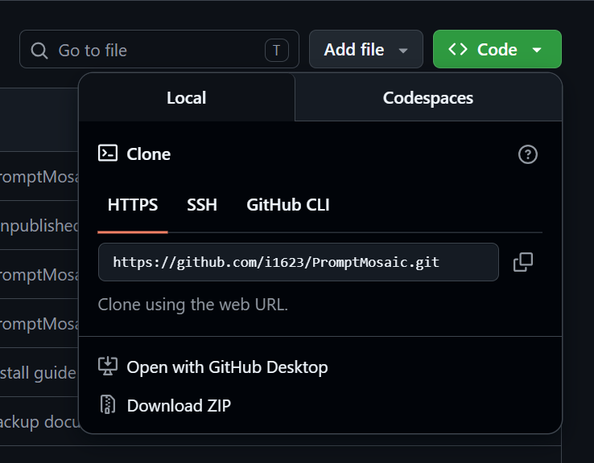
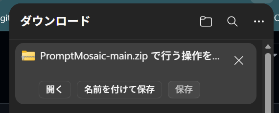
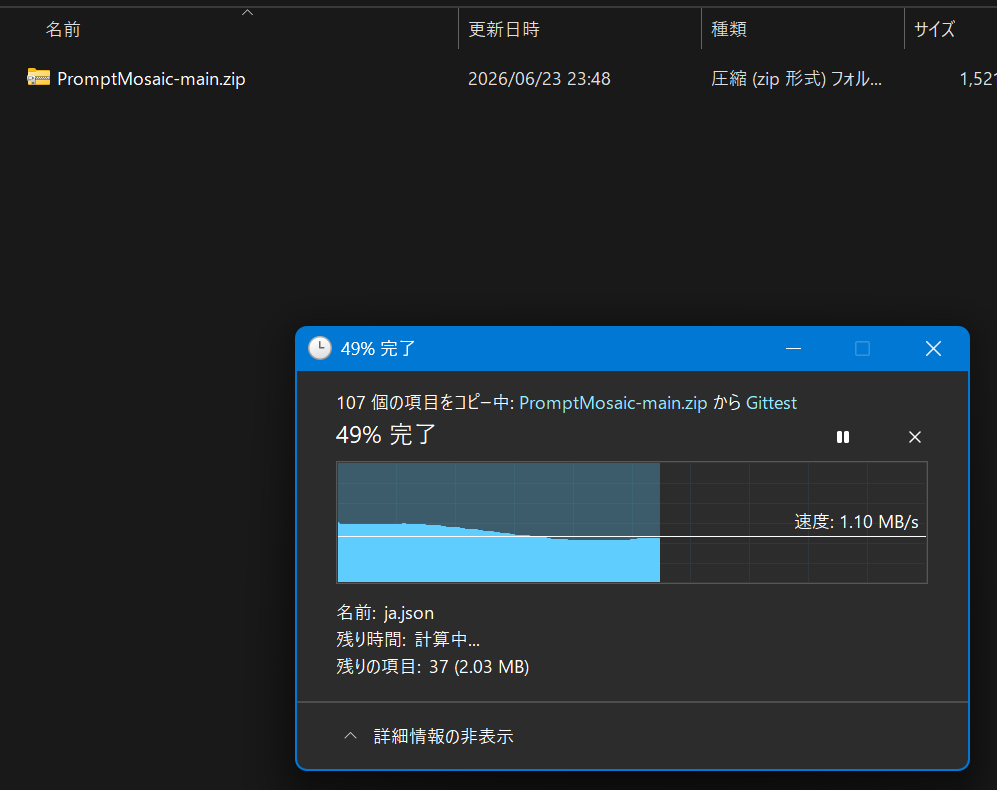
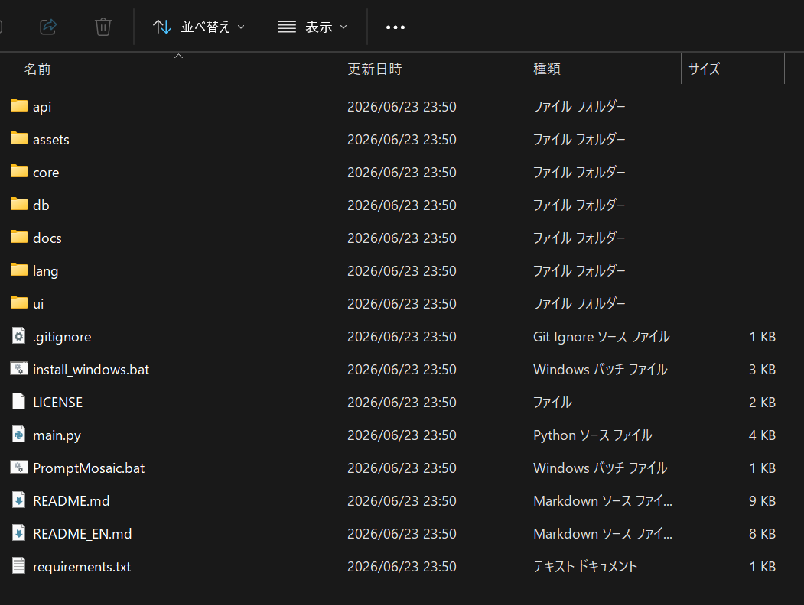
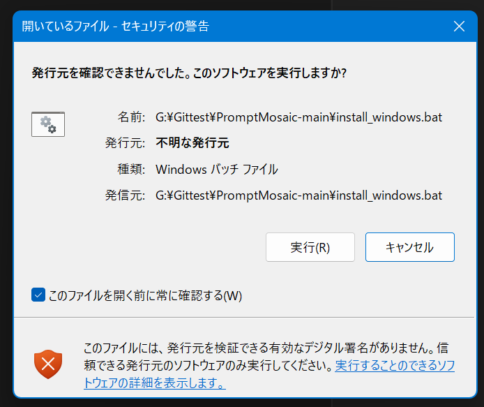

# PromptMosaic チュートリアル — はじめての 1 枚まで

[日本語](TUTORIAL.md) | [English](TUTORIAL_EN.md)

このチュートリアルは、**PromptMosaic を初めて使う方**が、インストールから最初の画像を生成するまでを一通り体験するための案内です。
各機能の詳細な説明は [操作説明書（MANUAL.md）](MANUAL.md) を参照してください。

> 📷 *スクリーンショット差し込み位置: アプリ起動直後のメイン画面全体*
> `docs/images/main_window.png`

---

## 目次

1. [PromptMosaic とは](#1-promptmosaic-とは)
2. [準備するもの](#2-準備するもの)
3. [インストールと起動](#3-インストールと起動)
4. [InvokeAI と連携する（初回セットアップ）](#4-invokeai-と連携する初回セットアップ)
5. [画面の見方（3 ペイン構成）](#5-画面の見方3-ペイン構成)
6. [最初のプロンプトを組み立てる](#6-最初のプロンプトを組み立てる)
7. [モデルと生成パラメータを選ぶ](#7-モデルと生成パラメータを選ぶ)
8. [生成する](#8-生成する)
9. [履歴を活用する](#9-履歴を活用する)
10. [次のステップ](#10-次のステップ)

---

## 1. PromptMosaic とは

PromptMosaic は、**英語プロンプトと日本語などの表示名を同時に見ながら、プロンプトを「タイル」として組み立て、InvokeAI へ生成を依頼する**ローカル GUI ツールです。

主なポイントは次のとおりです。

- **画像生成は InvokeAI が行います。** PromptMosaic は単体では画像を作りません。プロンプトとパラメータを整え、InvokeAI のキューへ送る役割です。
- **InvokeAI と画面を分割して使うことを想定しています。** 片側に InvokeAI のキャンバス / ビューア、もう片側に PromptMosaic を置くと、生成結果を見ながらプロンプト編集・履歴管理・再生成ができます。
- **プロンプトと和訳・現地語表示を並べて扱えます。** タイル表示を 2 段にすると、英語プロンプトと日本語などの表示名を同時に確認できます。
- **翻訳用 LLM を使えます。** LM Studio などを設定しておくと、日本語の単語や文章を英語プロンプトへ翻訳し、そのままタイルとして追加できます。
- **PromptMosaic は InvokeAI の「ワークフローテンプレート」を使います。** あなたの InvokeAI 環境で実際に生成された txt2img ワークフローを取り込み、そこにプロンプト・シードなどを差し込んで生成します。だから最初に「テンプレートの取得」が必要になります。

---

## 2. 準備するもの

| 必要なもの | 補足 |
| --- | --- |
| **InvokeAI 6.13 以降** | 別途インストールし、起動できる状態にしておきます |
| **Python 3.11（推奨）** | Windows の公式インストーラ版（Conda/Anaconda 不可） |
| **InvokeAI に導入済みのモデル** | SDXL / SD 1.x / FLUX / FLUX2 / Anima など、使いたいベースモデル |

> ⚠️ **Conda / Anaconda の Python は使えません。** Qt の DLL が競合するため、`python.org` 配布の通常版 Python を使ってください。`install_windows.bat` は Conda 環境を自動的に避けます。
> インストーラは Python 3.11 → 3.12 → 3.10 の順に探しますが、公開手順の基準は Python 3.11 です。

---

## 3. インストールと起動

ここでは、GitHub を初めて使う人向けに説明します。

### 3-1. PromptMosaic 一式をダウンロードする

1. PromptMosaic の GitHub ページを開きます。
2. 画面の右上あたりにある緑色の **Code** ボタンを押します。
3. 出てきたメニューから **Download ZIP** を押します。
4. `PromptMosaic-main.zip` のような ZIP ファイルがダウンロードされます。
5. ダウンロードした ZIP ファイルを右クリックし、**すべて展開** を選びます。
6. 展開先は、たとえば `ドキュメント` や `D:\tools` など、自分が分かる場所で構いません。



ブラウザのダウンロード欄に ZIP ファイルが表示されたら、開くか、保存先のフォルダを開いてください。



ZIP ファイルを開いたあと、中身を通常のフォルダへコピーまたは展開します。展開が終わるまで少し待ちます。



> ⚠️ `install_windows.bat` だけを右クリック保存してもインストールできません。PromptMosaic は、`main.py`、`requirements.txt`、`ui` フォルダなど、たくさんのファイルを一緒に使います。必ず ZIP を丸ごと展開してください。

### 3-2. インストールする

展開したフォルダを開きます。中に `install_windows.bat` があるので、それをダブルクリックします。



Windows が「発行元を確認できませんでした。このソフトウェアを実行しますか？」という警告を出すことがあります。これは、個人配布のバッチファイルにデジタル署名がないために表示される Windows の標準確認です。

ファイル名が、展開した PromptMosaic フォルダ内の `install_windows.bat` であることを確認してから、**実行** を押してください。



```bat
:: 初回のみ: 仮想環境(.venv)を作成し依存パッケージを導入
install_windows.bat
```

黒い画面が開き、自動でインストールが進みます。成功すると `.venv` フォルダが作られ、最後に `Install complete.` と表示されます。

途中で失敗した場合も、黒い画面はすぐ閉じません。英語のメッセージが表示されるので、その内容を確認してからキーボードの何かのキーを押して閉じてください。

### 3-3. 起動する

インストールが終わったら、同じフォルダにある `PromptMosaic.bat` をダブルクリックします。

```bat
:: 2 回目以降の起動はこれだけ
PromptMosaic.bat
```

2 回目以降は、`install_windows.bat` ではなく `PromptMosaic.bat` を使います。

> 📷 *スクリーンショット差し込み位置: install_windows.bat 実行後のコンソール*
> `docs/images/install_console.png`

---

## 4. InvokeAI と連携する（初回セットアップ）

**先に InvokeAI（6.13 以降）を起動しておいてください。** その状態で PromptMosaic を初めて起動すると、**「InvokeAI データ取得」** ウィザードが自動で開きます。
（あとから開きたいときは **設定 → InvokeAI データ取得を開く** から再表示できます。）

> 📷 *スクリーンショット差し込み位置: InvokeAI データ取得ウィザード*
> `docs/images/invoke_setup.png`

### ステップ 1：モデル / LoRA を取得

ウィザードは InvokeAI への接続を 3 秒ごとに自動確認します。接続できると、InvokeAI に登録されている**モデルと LoRA の一覧を自動取得**します。完了するとステップ 2 に進めるようになります。

> InvokeAI の URL とキュー ID は、既定で `http://localhost:9090` / `default` です。変更が必要な場合は **設定 → 接続** タブで調整できます。

### ステップ 2：ベースモデルごとに生成テンプレートを取得

PromptMosaic は**ベースモデル（SDXL, SD 1.x, FLUX など）ごとに 1 つ以上の「生成テンプレート」**を必要とします。テンプレートは、InvokeAI で実際に生成した txt2img ワークフローから取り込みます。

1. **InvokeAI 側で、使いたいベースモデルの画像を 1 枚生成します。**
   - ⚠️ このとき **LoRA を必ず 1 つ以上使ってください。** PromptMosaic はテンプレート内の LoRA 経路を「見本」として再利用するため、LoRA を含む生成が必要です。
2. PromptMosaic のウィザードで、そのベースモデルの行の **「取得」** ボタンを押します。
3. テンプレート名を確認（そのままでも OK）して取得すると、`準備済み` 表示に変わります。

VAE・リファイナー・テキストエンコーダーなど設定違いのテンプレートは、**別々のテンプレートとして**何個でも登録できます。InvokeAI 側で設定を変えて生成 → 取得、を繰り返すたびに新しいテンプレートとして追加され、**名前で区別**します（不要なものは 🗑 で削除）。

> ✅ 使いたいベースモデルがすべて「準備済み」になればセットアップ完了です。すべて揃っていなくても、準備済みのベースモデルだけで生成を始められます。

---

## 5. 画面の見方（3 ペイン構成）

PromptMosaic は左・中央・右の 3 ペインで構成されています。

```
┌──────────┬───────────────────────────┬──────────┐
│ 左ペイン   │      中央ペイン               │ 右ペイン   │
│          │   （プロンプトエディタ）         │          │
│ タグ /    │   タイルを並べてプロンプトを      │ 生成履歴 / │
│ モデル /   │   組み立てる                  │ ノート /   │
│ LoRA /    │                            │ ゴミ箱     │
│ 文章      │   下部に生成バー               │          │
└──────────┴───────────────────────────┴──────────┘
```

- **左ペイン（タグブラウザ）** — `◀ タグ` ボタンで開閉。タブで **タグ / モデル / LoRA / 文章** を切り替え。登録済みのタグや文章があれば、ここから中央へドラッグ＆ドロップできます。
- **中央ペイン（プロンプトエディタ）** — プロンプトの本体。タイルをブロック（Positive / Negative など）に並べて組み立てます。下部に生成ボタンとパラメータがあります。
- **右ペイン（サイドパネル）** — `履歴 ▶` ボタンで開閉。**履歴 / ノート / ゴミ箱** のタブがあります。

> 📷 *スクリーンショット差し込み位置: 3 ペインに番号を振った注釈付き画面*
> `docs/images/three_panes.png`

---

## 6. 最初のプロンプトを組み立てる

初回起動直後は、タグブラウザにまだ何も登録されていない場合があります。その場合は、中央ペインから直接プロンプトを作るのが一番早いです。

### 方法 A: 入力欄からタイルを作る

1. 中央ペインの **Positive ブロック** 下部にある入力欄へ、英語タグを入力します。
2. 複数の単語はカンマ区切りで入力できます。
   - 例: `masterpiece, 1girl, blonde hair, blue eyes:1.2`
3. **追加** を押すと、入力したタグが複数のタイルとして並びます。
4. 文章としてそのまま置きたい場合は **文章追加** を使います。カンマで分割せず、1 つの文章タイルとして追加されます。
5. タイルは次のように操作できます。
   - **ドラッグで並べ替え**
   - **クリックで ON / OFF**（一時的に外す）
   - **強調（emphasis）の増減**でそのタグの効きを強める／弱める
6. ネガティブを入れたい場合は **Negative ブロック** に同じ要領でタイルを置きます。

### 方法 B: InvokeAI で作った画像から始める

InvokeAI で生成した PNG / WebP を PromptMosaic の中央ペインへドロップすると、画像メタデータからプロンプトを読み込める場合があります。対応メタデータが見つかると、Positive / Negative の内容をタイルとして配置できます。

最初の 1 枚を作る前に、InvokeAI 側で作った画像が手元にあるなら、この方法がいちばん早いことがあります。

### 翻訳を使う場合

LM Studio などの翻訳 LLM を設定しておくと、日本語から英語プロンプトを作れます。

- **単語翻訳追加** — 日本語の単語や短い語句を、英語タグのタイルにして追加します。
- **文章翻訳追加** — 日本語の文章を、英文プロンプトの文章タイルにして追加します。

翻訳は任意機能です。LM Studio を設定していなくても、英語タグを直接入力すれば生成できます。

> 💡 タグブラウザは、タグを登録・インポートしたあとに便利になります。初回は手入力や画像ドロップから始めても問題ありません。

> 📷 *スクリーンショット差し込み位置: タイルを並べた中央ペイン*
> `docs/images/tiles.png`

---

## 7. モデルと生成パラメータを選ぶ

中央ペイン下部の生成バーで設定します。

- **ベースモデル / モデル** — 左ペインの **🧠 モデル** タブでモデルをダブルクリックして選択します。ベースモデルに合ったテンプレートが使われます。
- **解像度（幅 × 高さ）** — px 指定（8 の倍数に自動補正）。
- **Steps / CFG / Scheduler** — 生成ステップ数・プロンプト忠実度・スケジューラ。
  - ※ FLUX2 など蒸留モデルでは CFG が 1.0 固定になります。
- **Count（枚数）** — 1 回の生成で作る枚数。
- **シード** — 🎲 でランダム、`🔓/🔒` トグルでシード固定の ON/OFF。
- **InvokeAI での保存先** — InvokeAI 側のどのボードに保存するか。

> 📷 *スクリーンショット差し込み位置: 生成バー（モデル・解像度・seed など）*
> `docs/images/generation_bar.png`

---

## 8. 生成する

生成ボタンは 3 種類あります。最初は **履歴生成** で十分です。

| ボタン | 動作 |
| --- | --- |
| **履歴生成** | プロンプトを履歴に記録して生成します。横のチェック（マップ / 1 件）で記録方法を調整。**まずはこれ。** |
| **1️⃣ 履歴 1 件生成** | Count 枚を生成し、代表 1 件だけ履歴に残します。 |
| **単純生成** | PromptMosaic には履歴を残さず、InvokeAI へ送るだけ。 |

ボタンを押すと InvokeAI のキューに送られ、生成が完了すると右ペインの **履歴** に画像が現れます。

> ⚠️ 生成ボタンが押せないときは、メッセージを確認してください。「生成テンプレートがありません」と出る場合は、[ステップ 2](#4-invokeai-と連携する初回セットアップ) のテンプレート取得が未完了です。

> 📷 *スクリーンショット差し込み位置: 生成直後・右ペインに履歴が出た状態*
> `docs/images/first_result.png`

---

## 9. 履歴を活用する

PromptMosaic の真価は **生成の系譜（履歴）の再利用**にあります。

- **右ペインの履歴**をダブルクリックすると、その生成のプロンプト・パラメータを中央ペインに復元できます。
- 復元した状態から少し変えて再生成すると、その生成は**元の生成の「子」**として記録されます。
- 中央ペイン上部の **🗺️ 履歴マップ** を開くと、生成の親子関係が**ツリー（パラレルワールド）**で表示されます。過去の任意の時点へジャンプして、そこから別の枝を伸ばせます。

> 📷 *スクリーンショット差し込み位置: 履歴マップ（系譜ツリー）*
> `docs/images/history_map.png`

詳しい操作は [操作説明書の「履歴マップ」](MANUAL.md#履歴マップパラレルワールド) を参照してください。

---

## 10. 次のステップ

これで基本の流れは完了です。さらに使いこなすには：

- **[操作説明書（MANUAL.md）](MANUAL.md)** で全機能を確認する
- **マルチモデルプラン**で複数モデルを一度に巡回生成する → [MANUAL: マルチモデルプラン](MANUAL.md#マルチモデルプラン)
- **タイルグループ / 文章プロンプト**でよく使う組み合わせを保存する
- **data フォルダのコピー**で大切なプロンプトと履歴を守る → [MANUAL: バックアップ](MANUAL.md#バックアップ)

ようこそ、PromptMosaic へ。良い生成を！
